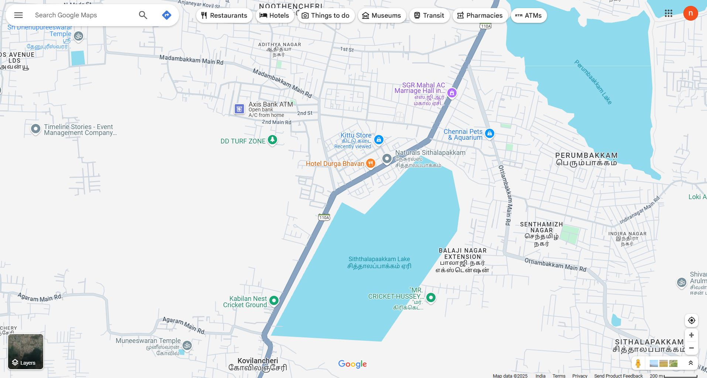
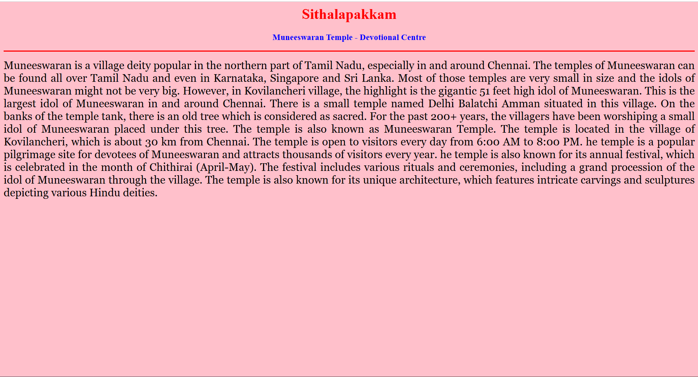
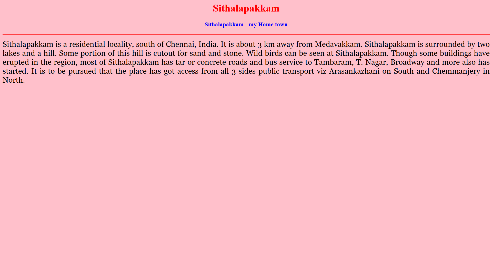
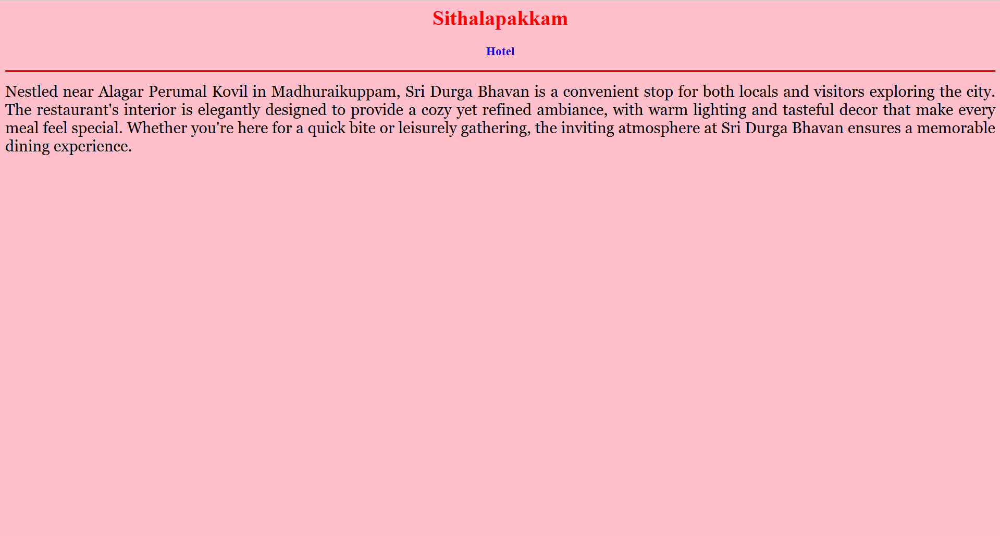
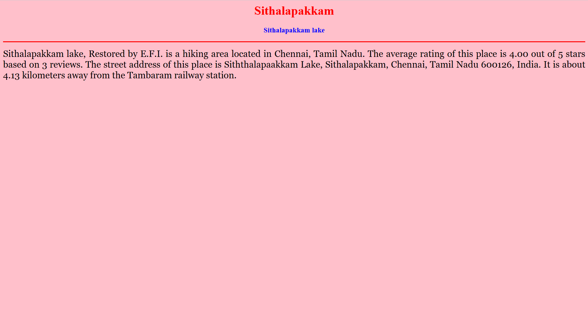

# Ex04 Places Around Me
# Date:17-04-2025
# AIM
To develop a website to display details about the places around my house.

# DESIGN STEPS
## STEP 1
Create a Django admin interface.

## STEP 2
Download your city map from Google.

## STEP 3
Using <map> tag name the map.

## STEP 4
Create clickable regions in the image using <area> tag.

## STEP 5
Write HTML programs for all the regions identified.

## STEP 6
Execute the programs and publish them.

# CODE
~~~
map.html
<html>
<head>
<title>My City</title>
</head>
<body>
<h1 align="center">
<b>Sithalapakkam</b>
</h1>
<h3 align="center">
<b>D.Nitish Adavan (24901049)</b>
</h3>

<map name="MyCity">
    <area shape="rect" coords="700,250,850,400" href="home.html" title="My Home Town">
    <area shape="circle" coords="570,230,45" href="temple.html" title="Muneeswaran Templ">
    <area shape="circle" coords="640,200,30" href="lake.html" title="Sithalapakkam Lake">
    <area shape="circle" coords="1120,360,25" href="Turf.html" title="DD Turf Zone">
    <area shape="rect" coords="950,120,1100,140" href="Hotel.html" title="Hotel Durga">
    </map>
</map>

</body>
</html>

home.html
<html>
<head>
<title>My Home Town</title>
</head>
<body bgcolor="pink">
<h1 align="center">
<b>Sithalapakkam</b>
</h1>
<h3 align="center">
<b>Sithalapakkam - my Home town</b>
</h3>

    Sithalapakkam is a residential locality, south of Chennai, India. It is about 3 km away from Medavakkam. Sithalapakkam is surrounded by two lakes and a hill. 
    Some portion of this hill is cutout for sand and stone. Wild birds can be seen at Sithalapakkam. 
    Though some buildings have erupted in the region, most of Sithalapakkam has tar or concrete roads and bus service to Tambaram, T. Nagar, Broadway and more also has started. 
    It is to be pursued that the place has got access from all 3 sides public transport viz Arasankazhani on South and Chemmanjery in North. 

</body>
</html>

turf.html
<html>
<head>
<title>My Home Town</title>
</head>
<body bgcolor="pink">
<h1 align="center">
<b>Sithalapakkam</b>
</h1>
<h3 align="center">
<b>DD Turf - play Area</b>
</h3>

    Sports Clubs in Madambakkam, Box-cricket Clubs in Madambakkam, Football Grounds in Madambakkam, Cricket-nets Clubs in Madambakkam, Volleyball Courts in Madambakkam, 
    Box-cricket Clubs in Chennai, Football Grounds in Chennai, Cricket-nets Clubs in Chennai, Volleyball Courts in Chennai, Sports Clubs in Chennai

</body>
</html>

lake.html
<html>
<head>
<title>My Home Town</title>
</head>
<body bgcolor="pink">
<h1 align="center">
<b>Sithalapakkam</b>
</h1>
<h3 align="center">
<b>Sithalapakkam lake</b>
</h3>

    Sithalapakkam lake, Restored by E.F.I. is a hiking area located in Chennai, Tamil Nadu. 
    The average rating of this place is 4.00 out of 5 stars based on 3 reviews.
    The street address of this place is Siththalapaakkam Lake, Sithalapakkam, Chennai, Tamil Nadu 600126, India. 
    It is about 4.13 kilometers away from the Tambaram railway station.

</body>
</html>

hotel.html
<html>
<head>
<title>My Home Town</title>
</head>
<body bgcolor="pink">
<h1 align="center">
<b>Sithalapakkam</b>
</h1>
<h3 align="center">
<b>Hotel</b>
</h3>

    Nestled near Alagar Perumal Kovil in Madhuraikuppam, Sri Durga Bhavan is a convenient stop for both locals and visitors exploring the city.
    The restaurant's interior is elegantly designed to provide a cozy yet refined ambiance, with warm lighting and tasteful decor that make every meal feel special.
    Whether you're here for a quick bite or leisurely gathering, the inviting atmosphere at Sri Durga Bhavan ensures a memorable dining experience.
    

</body>
</html>

temple.html
<html>
<head>
<title>My Home Town</title>
</head>
<body bgcolor="pink">
<h1 align="center">
<b>Sithalapakkam</b>
</h1>
<h3 align="center">
<b>Muneeswaran Temple - Devotional Centre</b>
</h3>

    Muneeswaran is a village deity popular in the northern part of Tamil Nadu, especially in and around Chennai. The temples of Muneeswaran can be found all over Tamil Nadu and even in Karnataka, Singapore and Sri Lanka. Most of those temples are very small in size and  the idols of Muneeswaran might not be very big.
     However, in Kovilancheri village, the highlight is the gigantic 51 feet high idol of Muneeswaran. This is the largest idol of Muneeswaran in and around Chennai.
     There is a small temple named Delhi Balatchi Amman situated in this village. On the banks of the temple tank, there is an old tree which is considered as sacred. For the past 200+ years, the villagers have been worshiping a small idol of Muneeswaran placed under this tree. The temple is also known as Muneeswaran Temple. The temple is located in the village of Kovilancheri, which is about 30 km from Chennai. The temple is open to visitors every day from 6:00 AM to 8:00 PM. 
     he temple is a popular pilgrimage site for devotees of Muneeswaran and attracts thousands of visitors every year.
     he temple is also known for its annual festival, which is celebrated in the month of Chithirai (April-May). The festival includes various rituals and ceremonies, including a grand procession of the idol of Muneeswaran through the village. The temple is also known for its unique architecture, which features intricate carvings and sculptures depicting various Hindu deities.

</body>
</html>
~~~
# OUTPUT

# RESULT
The program for implementing image maps using HTML is executed successfully.
